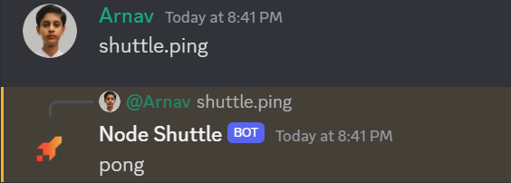

<p align="center"></p>
<br/>

# Node.js on shuttle.dev Template
This Template is a starting point for creating a Node.js project on the shuttle.dev. It is a simple discord bot template that can be used to create a discord bot using the discord.js library, or any other Node.js project.
<br/>

**Example of a bot running on shuttle.rs:**


## Pre-requisites
- [rust](https://www.rust-lang.org/tools/install) installed
- [cargo-shuttle CLI](https://docs.shuttle.dev/getting-started/installation) installed
- [Node.js](https://nodejs.org/en/download/) installed (obv)

## Getting Started
- Create a new project using the template
  ```bash
  shuttle init --from arnav-kr/node-shuttle
  ```
- rename `Secrets.example.toml` to `Secrets.toml` and put your environment variables there. Those will be deployed to the shuttle.dev project.

- deploy the project
  ```bash
  npm run deploy
  ```

## Deploy via GitHub Actions
The template comes with a GitHub Actions workflow that deploys the project to shuttle.dev on every push to the main branch.
> [!IMPORTANT]
> To enable the workflow, you need to add the [`SHUTTLE_TOKEN`](https://console.shuttle.dev/account/overview) and `SHUTTLE_PROJECT_ID` to the repository secrets.

## Development
use general node workflow for development.

## Adding to an existing project
Copy the following files to your project:
- [ ] [`Shuttle.toml`](Shuttle.toml) (rename names according to your project, include any additions assets here)
- [ ] [`Cargo.toml`](Cargo.toml) (rename names according to your project)
- [ ] [`src/main.rs`](src/main.rs)
- [ ] [`shuttle_run.sh`](shuttle_run.sh)
- [ ] [`shuttle_setup_container.sh`](shuttle_setup_container.sh)
- [ ] add shuttle related entries to [`.gitignore`](.gitignore)
- [ ] (optional) [`Secrets.example.toml`](Secrets.example.toml) (rename to `Secrets.toml` and add your environment variables)
- [ ] (optional) [`.github/workflows/deploy.yml`](.github/workflows/deploy.yml) (if you want to deploy via GitHub Actions)

deploy the project using `npm run deploy`

## License
This project is licensed under the AGPL 3.0 License - see the [LICENSE](LICENSE) file for details

## Author
[Arnav Kumar (@arnav-kr)](https://github.com/arnav-kr)